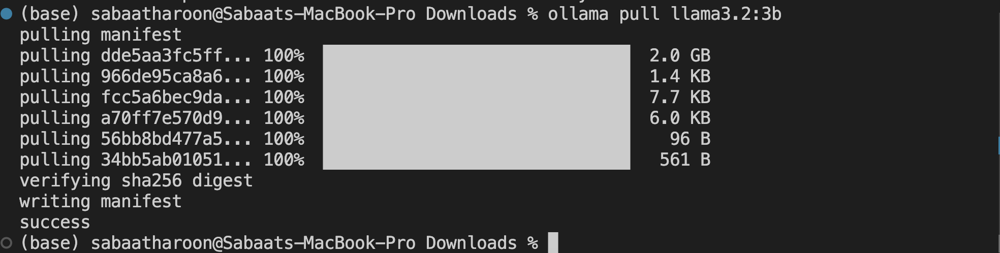
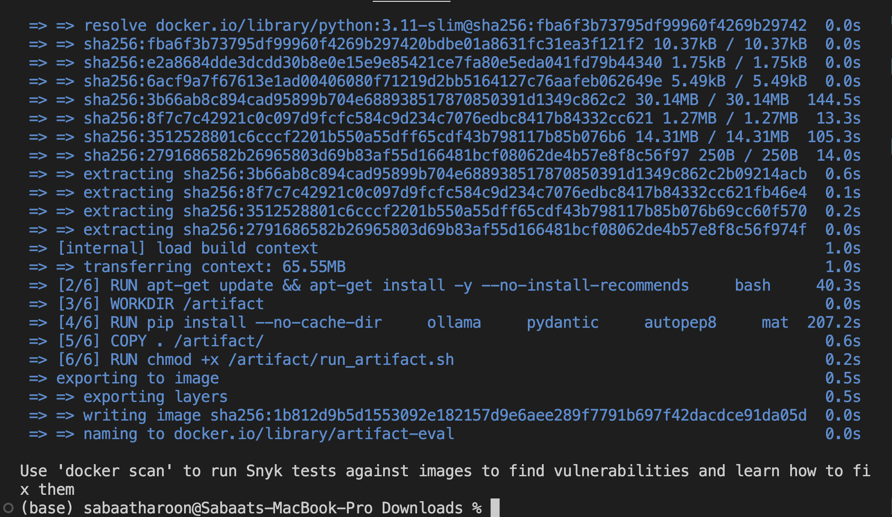

# Assessing the Impact of Code Changes on the Fault Localizability of Large Language Models

This document describes only the system requirements and installation procedure required to run the artifact.

------------------------------------------------------------------------

## 1. System Requirements

### Minimum (Artifact Evaluation Mode)

-   Docker
-   Ollama installed on host
-   12 GB RAM recommended
-   No GPU required

### Full Paper Reproduction

-   GPU required
-   Java (for Java pipeline)
-   Larger runtime expected

------------------------------------------------------------------------

## 2. Install Docker

Verify installation:

``` bash
docker --version
```

If Docker is not installed:

-   Linux: https://docs.docker.com/engine/install/
-   macOS / Windows: https://www.docker.com/products/docker-desktop/

After installation, confirm Docker runs successfully before proceeding.

------------------------------------------------------------------------

## 3. Install Ollama

Download and install from:

https://ollama.com/download

Verify installation:

``` bash
ollama --version
```

Pull required model:

``` bash
ollama pull llama3.2:3b
```


Start Ollama service if not already started:

``` bash
ollama serve
```

Expected output:

Listening on 127.0.0.1:11434

Keep this running while executing the artifact.

------------------------------------------------------------------------

## 4. Build the Docker Image

From the repository root directory:

``` bash
docker build -t artifact-eval ./artifact
```

Expected output:


------------------------------------------------------------------------
Successful execution confirms correct installation.
